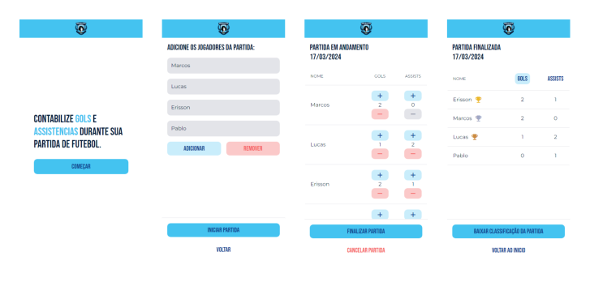

 

# [Players Stats Counter](https://players-stats-counter.vercel.app/)
An mobile web application for counting goals and assists between the players in a football match.



<br />

## Contents
[Tech Stack](#tech-stack) -
[Prerequisites](#prerequisites) -
[Dependencies](#dependencies) -
[Installing and Running](#installing-and-running) -
[Author](#author)

<br />

## Tech Stack
- React
- Typescript

<br />

## Prerequisites
- Git
- Node.js v20.3.1 (or higher)

<br />

## Dependencies
- React v18.2.0 (or higher)
- React-router-dom v6.22.2 (or higher)
- Styled-components v6.1.8 (or higher)

<br />

## Installing and Running
1. Clone this repository:
```
git clone https://github.com/marcosvbs/players-stats-counter
```
2. Access the repository page:
```
cd players-stats-counter
```
3. Install dependencies:
```
npm install
```
4. Run the project:
```
npm run dev
```
5. The application will start on port:5173 - Access <http://localhost:5173>.

<br />

## Author
 
<a href="https://github.com/marcosvbs">Marcos dos Santos</a>
<br />
<br />
Made with ❤️ by Marcos dos Santos 👋🏽 Get in touch!
<br />
Linkedin: https://www.linkedin.com/in/marcosdossantos
<br />
Mail: rrmarcosdossantos@gmail.com
